# pm-blog


**A Claude skill suite that writes, optimizes, and audits blog content, and refuses to hand you a draft until it clears a 90/100 quality bar.**

First, the honest part. I did not build the engine. [Daniel Agrici](https://agricidaniel.com/about) did, as [`claude-blog`](https://github.com/AgriciDaniel/claude-blog). This is our fork. We maintain it, we added multi-writer brand and voice support, and we run it on our own blog. Everything the engine does well is his work. Star the upstream project. Then read our code before you take my word for any of it.

What it does: every article is dual-optimized for Google (December 2025 Core Update, E-E-A-T) and for the AI platforms that now answer questions instead of linking to them (ChatGPT, Perplexity, Google AI Overviews). Before a draft reaches you, a five-gate delivery contract scores it against a 100-point rubric and blocks anything under 90. You are not the first reviewer. The gates are.

## What you actually get

Run `/blog write <topic>` and one command does the research, the outline, the draft, the schema, the internal links, and the citation checks. Every post ships as eight files in one folder:

- `.md`, the article with frontmatter, sourced citations, FAQ, and JSON-LD schema.
- `.html`, rendered with XSS-safe JSON-LD and dark-mode-aware CSS.
- `.pdf`, via Playwright or weasyprint.
- `hero.<ext>`, a 1200x630 image (Banana MCP, Gemini, stock APIs, or Openverse).
- Three viewport screenshots: `mobile-375.png`, `tablet-768.png`, `desktop-1280.png`.
- `review.md`, the five-category scorecard with the blocking line called out.
- `preflight-report.json`, the full audit trail.

## Who it's for

Three audiences, one engine.

**Solo bloggers and creators** who want to ship one strong post a week without losing three hours to the SEO checklist. The orchestrator handles research, outline, draft, schema, internal linking, and citation verification in a single `/blog write`.

**Marketing teams and agencies** running many posts across topics, languages, and platforms. You get topic-cluster planning (`/blog cluster`), one-command multilingual publishing (`/blog multilingual`), cannibalization detection (`/blog cannibalization`), and persona-driven voice profiles (`/blog persona`), so the same engine keeps the team's output consistent.

**Skill builders** who want a real reference for how a large Claude skill is put together: orchestrator, agent dispatch, delivery contracts, CI gating. The repo runs the Agent Skills open standard at real complexity, with 187 tests, version-coherence enforcement, and the five-gate contract. Read the source. Fork the patterns into your own skills.

## Quick start

Install as a Claude Code plugin, or in Claude Cowork through the marketplace.

**Claude Cowork:**

1. Add the marketplace URL: `https://github.com/promptmetrics/pm-blog`
2. Install the `pm-blog` plugin from the marketplace.
3. Restart Cowork to activate.

**Claude Code:**

```
/plugin marketplace add promptmetrics/pm-blog
/plugin install pm-blog@promptmetrics-pm-blog
```

New here? Run these three first: `/blog strategy <niche>` to scope the blog, `/blog write <topic>` to generate your first article (the five-gate contract runs automatically), and `/blog analyze <file>` to score it on the 100-point rubric.

## Architecture

One orchestrator routes every `/blog` command through the sub-skills, which spawn agents and call Python scripts over Bash. Nothing reaches you until it clears the contract.

<p align="center">
  
</p>

| Layer | Count | Where |
|---|---:|---|
| Sub-skills (user-invokable) | 29 | `skills/blog-*/SKILL.md` |
| Sub-skills (internal) | 1 | `skills/blog-chart/SKILL.md` |
| Specialist agents | 5 | `agents/blog-*.md` |
| On-demand references | 21 | `skills/blog/references/*.md` |
| Content templates | 12 | `skills/blog/templates/*.md` |
| Root-level Python scripts | 9 | `scripts/*.py` |
| Tests | 187 | `tests/test_*.py` |

Full directory tree, data-flow diagrams, and extension points: [`docs/ARCHITECTURE.md`](docs/ARCHITECTURE.md).

## The delivery contract (v1.9.0)

This is the part I care about most, and the reason the fork exists in a form I'd put my name on. Every draft passes five gates before you see it. Gate 4 is blocking: the review agent has to score 90 or higher with zero P0 issues, or the draft goes back to the writer. The writer iterates up to three times, then escalates to you rather than shipping something that failed.

<p align="center">
  
</p>

| Gate | Enforces | Runs |
|---|---|---|
| 1. Capability discovery | Required tools and agents present before the write | `scripts/blog_preflight.py --gate 1` |
| 2. Format completeness | `.md` + `.html` + `.pdf` + a real hero image | `scripts/blog_render.py`, `scripts/generate_hero.py` |
| 3. Visual verification | No SVG overflow, valid JSON-LD, dark mode renders | `patchright` / `playwright` at three viewport widths |
| 4. Content review (blocking) | `blog-reviewer` scores 90+ and zero P0 | `agents/blog-reviewer.md` |
| 5. Asset + link integrity | Every image resolves, og:image exists, links return 200, word count within 5% | `scripts/blog_preflight.py --gate 5` |

Hero image ladder, first available wins: Banana MCP, direct Gemini API, premium stock (Unsplash, Pexels, Pixabay), Openverse. Full spec: [`skills/blog/references/blog-delivery-contract.md`](skills/blog/references/blog-delivery-contract.md).

## Commands

| Command | What it does |
|---------|-------------|
| `/blog write <topic>` | Write a new post from scratch |
| `/blog rewrite <file>` | Optimize an existing post |
| `/blog analyze <file>` | Quality audit with a 0-100 score |
| `/blog brief <topic>` | Detailed content brief |
| `/blog calendar` | Editorial calendar |
| `/blog strategy <niche>` | Blog strategy and topic ideation |
| `/blog outline <topic>` | SERP-informed outline |
| `/blog seo-check <file>` | Post-writing SEO validation |
| `/blog schema <file>` | JSON-LD schema markup |
| `/blog repurpose <file>` | Repurpose for social, email, YouTube |
| `/blog geo <file>` | AI citation readiness audit |
| `/blog image [generate\|edit\|setup]` | AI image generation via Gemini |
| `/blog audit [directory]` | Full-site blog health assessment |
| `/blog cannibalization [directory]` | Detect keyword overlap across posts |
| `/blog factcheck <file>` | Verify statistics against cited sources |
| `/blog persona [create\|list\|apply]` | Manage writing personas and voice profiles |
| `/blog taxonomy [sync\|audit\|suggest]` | Tag and category CMS management |
| `/blog notebooklm <question>` | Query NotebookLM for source-grounded research |
| `/blog audio [generate\|voices\|setup]` | Audio narration via Gemini TTS |
| `/blog google [command] [args]` | Google API data: PSI, CrUX, GSC, GA4, NLP, YouTube, Keywords |
| `/blog cluster [plan\|execute] <seed>` | Topic-cluster planning and execution (hub and spoke) |
| `/blog multilingual <topic> --languages <codes>` | Write, translate, localize, emit hreflang in one command |
| `/blog translate <file> --to <codes>` | SEO-optimized translation with format preservation |
| `/blog localize <file> --locale <code>` | Cultural deep-adaptation per locale |
| `/blog locale-audit <directory>` | Multilingual QA (completeness, hreflang, parity, freshness) |
| `/blog flow [find\|optimize\|win\|prompts\|sync]` | FLOW framework prompts (evidence-led) |
| `/blog brand [init\|show\|update]` | Generate BRAND.md + VOICE.md, auto-loaded by all sub-skills |
| `/blog discourse <topic>` | API-free last-30-days discourse research |

30 sub-skill directories total: 29 user-invokable (28 distinct slash commands, plus `/blog update` aliased to rewrite) and 1 internal-only (`blog-chart`, called by write and rewrite for inline SVG charts). `blog-image` is both.

For PromptMetrics-operated installs, `BRAND.md` is synced automatically from a private repo (not in this public fork) rather than authored locally. See `/blog brand sync`.

## How the sub-skills fit together

<p align="center">
  
</p>

## How does pm-blog compare?

pm-blog is a structured pipeline. Direct prompting is one-shot. Hosted SaaS is closed. Here is the honest tradeoff, including where pm-blog is not the answer.

| Capability | pm-blog | Direct Claude / ChatGPT | Copy.ai / Jasper | Build it yourself |
|---|:---:|:---:|:---:|:---:|
| Full article in one command, with an iteration loop | yes (5-gate, up to 3 retries) | one-shot | yes | no |
| Sourced statistics with verification | yes (`/blog factcheck` fetches URLs) | hallucinates | no | manual |
| AI citation optimization (GEO / AEO) | yes (`/blog geo`) | no | no | partial |
| Blocking content review (90 to deliver) | yes (`blog-reviewer`) | no | no | no |
| Multilingual + hreflang, one command | yes (`/blog multilingual`) | no hreflang | partial | no |
| Topic-cluster planning | yes (`/blog cluster`) | no | partial | no |
| Audio narration | yes (Gemini TTS, 30 voices) | no | no | no |
| Hero image generation | yes (4-step ladder) | no | stock only | partial |
| Persistent brand and voice context | yes (BRAND.md + VOICE.md) | per-prompt | limited | no |
| Open-source, MIT, no usage cost | yes | subscription | subscription | yes |

pm-blog is not better at everything. Direct prompting is faster for a single throwaway draft. Hosted SaaS is easier if you don't write code. DIY is more flexible for a one-off pipeline. pm-blog fits when you want content that clears a real bar, at scale, without a SaaS subscription.

## Features

### 12 content templates
Auto-selected by topic and intent: how-to guide, listicle, case study, comparison, pillar page, product review, thought leadership, roundup, tutorial, news analysis, data research, FAQ knowledge base.

### Five-category scoring (100 points)

| Category | Points | Focus |
|----------|:---:|-------|
| Content quality | 30 | Depth, readability, originality, engagement |
| SEO optimization | 25 | Headings, title, keywords, links, meta |
| E-E-A-T signals | 15 | Author, citations, trust, experience |
| Technical elements | 15 | Schema, images, speed, mobile, OG tags |
| AI citation readiness | 15 | Citability, Q&A format, entity clarity |

Bands: Exceptional (90-100), Strong (80-89), Acceptable (70-79), Below standard (60-69), Rewrite (under 60). The v1.9.0 contract blocks delivery below 90.

### AI content detection
Burstiness scoring on sentence-length variance, known AI-phrase detection (17 phrases), and vocabulary diversity (TTR). It flags prose that reads as machine-generated before the reviewer ever sees it.

### Persona-driven writing
Configurable personas on the NNGroup four-dimension tone framework (formal/casual, serious/funny, respectful/irreverent, matter-of-fact/enthusiastic). Manage voice profiles per blog or author, with readability bands (Consumer, Professional, Technical) and style enforcement at draft time.

### Fact-checking pipeline
`/blog factcheck` fetches every cited source URL and scores claim confidence: exact match, paraphrase, or not found. Every data point is traceable, not invented.

### Keyword cannibalization detection
`/blog cannibalization` finds keyword overlap across posts using local grep analysis or the DataForSEO API, with severity scoring and merge-or-differentiate recommendations, so your own posts stop competing with each other.

### CMS taxonomy management
Tag and category sync for WordPress REST, Shopify GraphQL, Ghost, Strapi, and Sanity, with suggest, sync, and audit workflows.

### Dual optimization
Every article targets both Google and the AI answer engines:
- **Google:** December 2025 Core Update compliance, E-E-A-T signals, schema markup, internal linking, Core Web Vitals awareness via blog-google.
- **AI citations:** answer-first formatting, citation capsules, passage-level citability (120 to 180 word blocks), FAQ schema, entity clarity.

### Visual media
- Pixabay, Unsplash, and Pexels sourcing with HTTP 200 verification and auto-generated alt text.
- AI image generation via Gemini for heroes, inline illustrations, and social cards. Needs a free Google AI API key.
- Built-in SVG chart generation in seven styles: bar, grouped bar, lollipop, donut, line, area, radar.
- YouTube embedding with `srcdoc` lazy loading and a noscript AI-crawler fallback.

### Google API integration (v1.6.5+)
13 commands across four credential tiers, all free at normal usage:
- **Tier 0** (API key): PageSpeed Insights, CrUX Core Web Vitals (25-week history), YouTube video search, NLP entity analysis.
- **Tier 1** (OAuth): Search Console performance, URL Inspection, Indexing API.
- **Tier 2** (GA4): organic traffic reports.
- **Tier 3** (Ads): Keyword Planner.

### NotebookLM research
Query Google NotebookLM for source-grounded answers from documents you uploaded. Tier 1 data quality with no hallucination risk, because the answers come from your own sources.

### Audio narration
`/blog audio` generates narration via Gemini TTS in three modes: summary (200 to 300 words), full article, and two-speaker dialogue. 30 voices, 80+ languages.

### Platform support
Next.js MDX, Astro, Hugo, Jekyll, WordPress, Ghost, 11ty, Gatsby, and static HTML. The orchestrator auto-detects the platform and adjusts frontmatter, image embedding, and schema.

### Foundational methodologies (v1.8.0)
Five reference documents under `skills/blog/references/` define the editorial and research method used across every sub-skill. Loaded on demand:

| Reference | Purpose | Used by |
|---|---|---|
| `ai-slop-detection.md` | First-order (phrases) and second-order (structural rhythm) AI-content detection | `blog-rewrite`, `blog-reviewer`, `blog-analyze` |
| `editorial-heuristics.md` | 10 Nielsen-adapted heuristics, 0-4 scoring, P0-P3 severity | `blog-analyze --rubric` |
| `cognitive-load.md` | Per-section concept density | `blog-analyze --cognitive-load` |
| `research-quality.md` | 5-dimension research rubric plus keyword-trap classes and freshness floors | `blog-researcher`, `blog-brief`, `blog-strategy` |
| `synthesis-contract.md` | 6 rules governing research synthesis | all research-synthesis sub-skills |

Adapted from [`pbakaus/impeccable`](https://github.com/pbakaus/impeccable) (Apache 2.0) and [`mvanhorn/last30days-skill`](https://github.com/mvanhorn/last30days-skill) (MIT). See [`CONTRIBUTORS.md`](CONTRIBUTORS.md).

### FLOW framework
FLOW (Find, Leverage, Optimize, Win) is the evidence-led workflow shared with [`AgriciDaniel/flow`](https://github.com/AgriciDaniel/flow) (CC BY 4.0). `/blog flow` exposes 30 ready-to-run prompts indexed by phase.

## Requirements

- Claude Cowork (with the marketplace added per Quick Start), or Claude Code.
- Python 3.11+ for quality scoring, the delivery-contract runners, and lint.
- Optional: `pip install -r requirements.txt` for readability scoring and schema detection.

### Quality gates (CI-enforced on every PR)

1. **pytest:** 187 tests across security, behavioral, regression, and delivery-contract suites.
2. **Plugin validation:** `claude plugin validate .` plus JSON and regex checks.
3. **Stale-path lint:** catches drift in `references/` and `templates/` cross-references.
4. **Prose hygiene:** `scripts/lint_prose.py` enforces the no-emdash, no-en-dash, no ` -- ` rule.
5. **Version coherence:** `tests/test_version_coherence.py` asserts `pyproject.toml`, `plugin.json`, `CITATION.cff`, and the SKILL.md frontmatter all match.
6. **Command coherence:** `tests/test_command_coherence.py` asserts the SKILL.md and `docs/COMMANDS.md` declare the same command set.

Run locally before you push:

```bash
python -m pytest tests/
python3 scripts/lint_prose.py
claude plugin validate .
```

## FAQ

**What is pm-blog?**
A Claude skill suite for writing, optimizing, and auditing blog content. It runs 30 sub-skills and 5 agents through a five-gate delivery contract, so every article meets a 90/100 bar before it reaches you.

**How is it different from prompting Claude or ChatGPT directly?**
Direct prompting gives you one draft from one prompt. pm-blog gives you a pipeline: research with sourced statistics, outline approval, draft, multi-pass scoring, AI-content detection, fact verification, schema injection, and a blocking review that iterates up to three times before delivery. It does what a senior editor would otherwise do by hand.

**What platforms does it support?**
Next.js MDX, Astro, Hugo, Jekyll, WordPress, Ghost, 11ty, Gatsby, and static HTML. The orchestrator auto-detects the platform and adjusts frontmatter, image embedding, and schema.

**Does it hallucinate statistics?**
No. Every cited statistic runs through `/blog factcheck`, which fetches the source URL and scores confidence (exact match, paraphrase, not found). The reviewer blocks publication if a citation can't be verified, or if AI-content detection flags the prose.

**Can I write in multiple languages?**
Yes. `/blog multilingual <topic> --languages en,de,fr,es,ja` writes the post, translates it while preserving frontmatter and schema, runs cultural adaptation per locale, and emits hreflang plus a CMS-ready language map, in one command.

**Is it safe to install?**
The installer ships Python scripts and markdown, and runs no remote code beyond what `pip install -r requirements.txt` brings in. The clone-then-checkout-tag flow lets you read `install.sh` before running it. Full threat model in [`SECURITY.md`](SECURITY.md).

## Uninstall

In Claude Cowork, remove `pm-blog` from your installed plugins. If you installed via `install.sh` or `install.ps1` directly, the matching uninstaller is still there:

```bash
chmod +x uninstall.sh && ./uninstall.sh      # Unix / macOS
```
```powershell
.\uninstall.ps1                               # Windows
```

## Integration

Chart generation and YouTube embedding are built in. Google API data needs a free key (`/blog google setup`). Optional companion skills for deeper analysis of published pages: `/seo`, `/seo-schema`, `/seo-geo`, `/seo-google`.

## Documentation

In [`docs/`](docs/): [Installation](docs/INSTALLATION.md), [Commands](docs/COMMANDS.md), [Architecture](docs/ARCHITECTURE.md), [Publishing](docs/PUBLISHING.md), [Templates](docs/TEMPLATES.md), [Troubleshooting](docs/TROUBLESHOOTING.md), [MCP Integration](docs/MCP-INTEGRATION.md).

## Security and Code of Conduct

- Security policy and threat model: [`SECURITY.md`](SECURITY.md). The v1.9.0 pass added XSS-safe JSON-LD, O_NOFOLLOW symlink refusal, and frontmatter validation, all mutation-test verified.
- Code of Conduct: [`CODE_OF_CONDUCT.md`](CODE_OF_CONDUCT.md). Contributor Covenant.

## Contributing

Contributions welcome. See [`CONTRIBUTING.md`](CONTRIBUTING.md). Before a PR:

1. `python -m pytest tests/` (all 187 pass).
2. `python3 scripts/lint_prose.py --root .` (zero violations).
3. `claude plugin validate .` (passes).
4. Bump versions coherently if you touch user-visible counts or behavior.

## How to cite

pm-blog is a fork of claude-blog. Cite the original (unmodified from upstream, per MIT attribution):

```bibtex
@software{Agrici_claude_blog_2026,
  author  = {Agrici, Daniel},
  title   = {claude-blog: AI Blog Writing and SEO Optimization Skill for Claude Code},
  year    = {2026},
  url     = {https://github.com/AgriciDaniel/claude-blog},
  version = {1.9.0},
  license = {MIT}
}
```

## License

MIT. See [`LICENSE`](LICENSE).

## Authors and fork notice

**Original author:** [Daniel Agrici](https://agricidaniel.com/about), AI Workflow Architect, who built the engine as `claude-blog`. His [blog](https://agricidaniel.com/blog), [YouTube](https://www.youtube.com/@AgriciDaniel), and [other tools](https://github.com/AgriciDaniel) are worth your time.

**Fork maintained by** [PromptMetrics](https://github.com/promptmetrics), forked from `claude-blog` to add multi-writer BRAND.md / VOICE.md support. MIT-licensed, same as upstream.

We build in the open. If you think any of this is wrong, the gates, the scoring, the way we fork, open an issue and tell me where.
